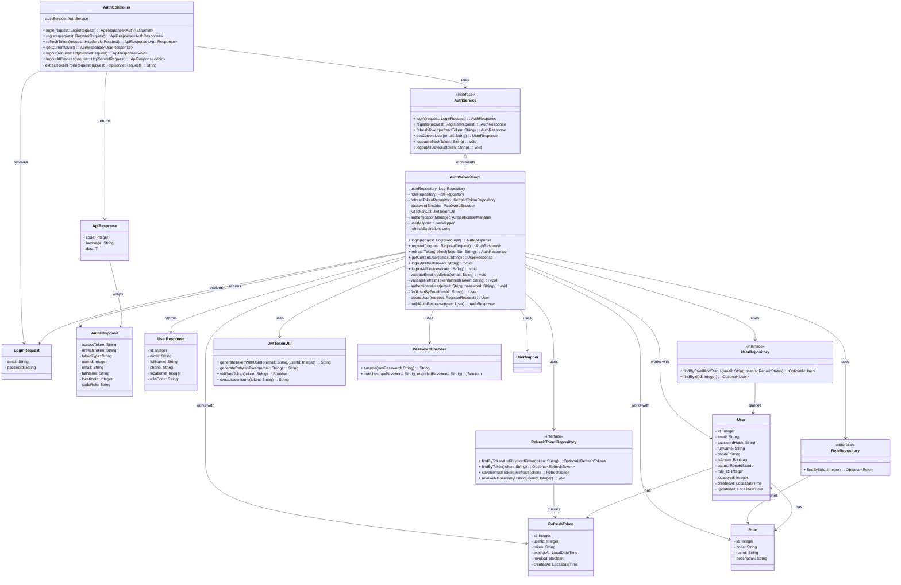

# Login Function - Detailed Class Diagram

## PlantUML Diagram
File: `LOGIN_DIAGRAM.puml`

Dùng các tools online sau để xem diagram:
- **PlantUML Online**: https://www.plantuml.com/plantuml/uml/
- **Draw.io**: https://app.diagrams.net/

Paste nội dung của file `LOGIN_DIAGRAM.puml` vào để visualize.

---

## Mermaid Class Diagram



---

## Step-by-Step Login Flow

### 1️⃣ **Request Phase**
```
┌─────────────┐
│   Client    │
└──────┬──────┘
       │ POST /api/v1/auth/login
       │ { email, password }
       ▼
┌──────────────────┐
│ AuthController   │
│ login()          │
└────────┬─────────┘
```

### 2️⃣ **Service Processing**
```
┌──────────────────────┐
│  AuthServiceImpl      │
│  login()             │
│                      │
│  1. authenticateUser │
│  2. findUserByEmail  │
│  3. buildAuthResponse│
└────────┬─────────────┘
```

### 3️⃣ **Authentication**
```
┌─────────────────────────┐
│ AuthenticationManager    │
│ authenticate(token)     │
│                         │
│ • Load user by email    │
│ • Verify password       │
│ • Return auth token     │
└──────────┬──────────────┘
           │
           ▼
┌──────────────────────┐
│ PasswordEncoder      │
│ matches()            │
│                      │
│ Compare with hash    │
└──────────────────────┘
```

### 4️⃣ **Token Generation**
```
┌──────────────────┐
│ JwtTokenUtil     │
│                  │
│ • accessToken    │
│ • refreshToken   │
└────────┬─────────┘
```

### 5️⃣ **Persistence**
```
┌──────────────────────────┐
│ RefreshTokenRepository   │
│ save(refreshToken)       │
└────────┬─────────────────┘
         │
         ▼
┌──────────────────┐
│ RefreshToken DB  │
└──────────────────┘
```

### 6️⃣ **Response**
```
┌──────────────────┐
│  AuthResponse    │
│                  │
│ • accessToken    │
│ • refreshToken   │
│ • userId         │
│ • email          │
│ • fullName       │
│ • codeRole       │
└────────┬─────────┘
         │
         ▼
┌──────────────────────┐
│ ApiResponse<T>       │
│ { data: AuthResponse }
└────────┬─────────────┘
         │
         ▼
┌─────────────┐
│   Client    │
└─────────────┘
```

---

## Component Interaction Matrix

| Component | UserRepository | RoleRepository | RefreshTokenRepository | JwtTokenUtil | PasswordEncoder |
|-----------|---|---|---|---|---|
| **AuthServiceImpl** | ✅ (find user) | ✅ (get role) | ✅ (save token) | ✅ (generate) | ✅ (encode) |
| **AuthenticationManager** | ❌ | ❌ | ❌ | ❌ | ✅ (verify) |
| **JwtTokenUtil** | ❌ | ❌ | ❌ | ❌ | ❌ |

---

## Error Scenarios

```
┌──────────────────────────────────────┐
│   Exception Handling                 │
├──────────────────────────────────────┤
│                                      │
│ ❌ Authentication Failed              │
│    └─> AppException(USER_NOT_EXISTED)│
│                                      │
│ ❌ User Not Found                     │
│    └─> AppException(USER_NOT_EXISTED)│
│                                      │
│ ❌ Role Not Found                     │
│    └─> AppException(USER_NOT_EXISTED)│
│                                      │
│ ❌ Invalid Refresh Token              │
│    └─> AppException(INVALID_TOKEN)   │
│                                      │
└──────────────────────────────────────┘
```

---

## Database Schema Relationships

```
┌────────────────────────────────────┐
│            User                    │
├────────────────────────────────────┤
│ PK: id                             │
│ email (UNIQUE)                     │
│ passwordHash                       │
│ fullName                           │
│ phone                              │
│ isActive                           │
│ status (RecordStatus)              │
│ FK: role_id ──┐                    │
│ locationId    │                    │
│ createdAt     │                    │
│ updatedAt     │                    │
└────────────────┼────────────────────┘
                 │ 1:N
                 │
                 ▼
         ┌────────────────────┐
         │      Role          │
         ├────────────────────┤
         │ PK: id             │
         │ code (UNIQUE)      │
         │ name               │
         │ description        │
         └────────────────────┘

┌────────────────────────────────────┐
│       RefreshToken                 │
├────────────────────────────────────┤
│ PK: id                             │
│ FK: userId ──┐                     │
│ token (UNIQUE)                     │
│ expiresAt                          │
│ revoked (DEFAULT: false)           │
│ createdAt                          │
└────────────────┼────────────────────┘
                 │ 1:N
                 │
                 ▼
         ┌────────────────────┐
         │      User          │
         └────────────────────┘
```

---

## Configuration & Annotations

### AuthServiceImpl
```java
@Service           // Spring Bean
@Slf4j             // Logging
@RequiredArgsConstructor  // Constructor injection
@Transactional     // Transaction management
```

### Methods
- `@Override @Transactional` - login method có transaction
- `@Value("${jwt.refresh-expiration:604800000}")` - Configuration injection

### Spring Security Integration
```
AuthenticationManager
    └─> ProviderManager
        └─> DaoAuthenticationProvider
            ├─> UserDetailsService
            ├─> PasswordEncoder
            └─> User Authentication
```

---

## Summary Table

| Aspect | Details |
|--------|---------|
| **Entry Point** | `POST /api/v1/auth/login` |
| **Input** | `LoginRequest { email, password }` |
| **Output** | `ApiResponse<AuthResponse>` |
| **Main Service** | `AuthServiceImpl.login()` |
| **Security** | Spring Security + JWT |
| **Database Operations** | 2-3 queries (user, role, save token) |
| **Error Handling** | Custom `AppException` with error codes |
| **Transaction** | Yes, `@Transactional` |
| **Logging** | SLF4J via `@Slf4j` |

